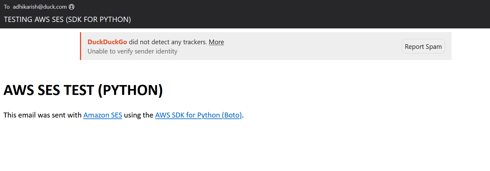

# AWS-SES-SMTP-Interface

- Copy the .env.example and create a .env file with the required contents
- `python3 -m venv venv` to create virtual environment
- `source venv/bin/activate` activate the virtual environment
- `pip install -r requirements.txt` install required packages
  
